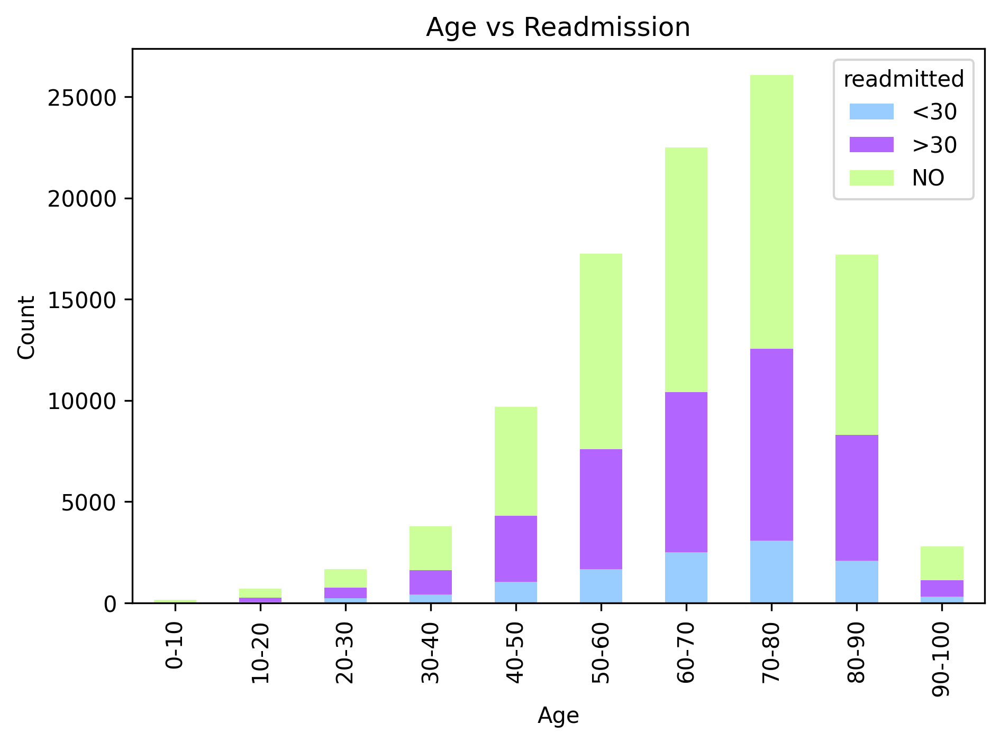
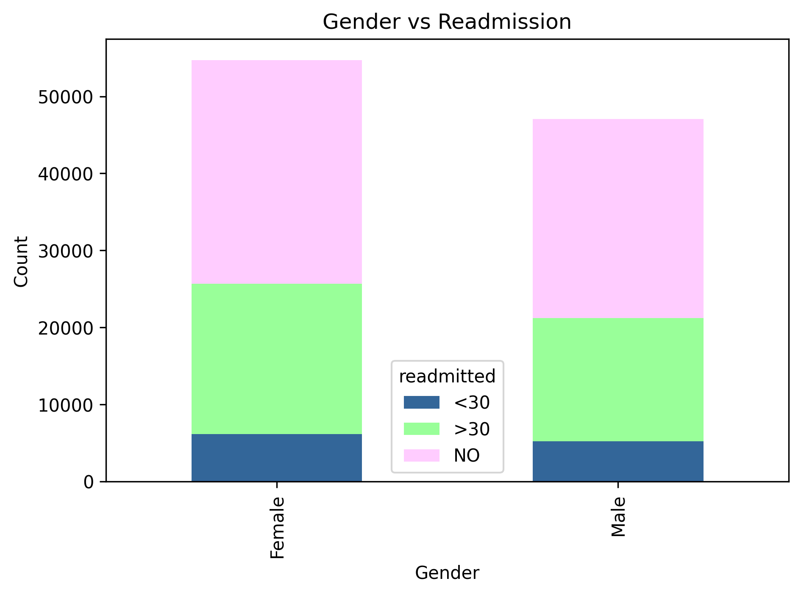
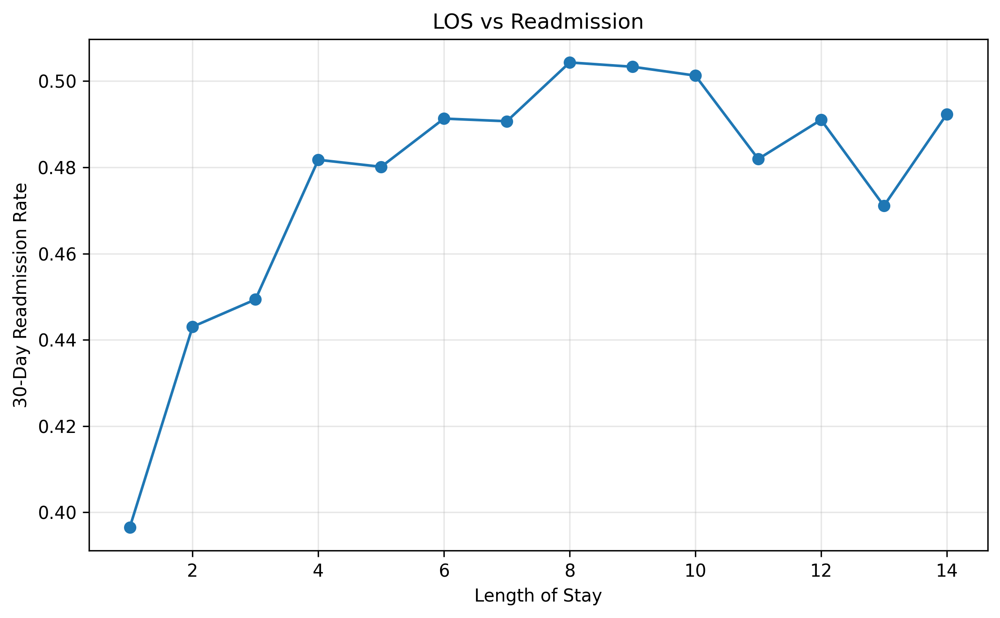
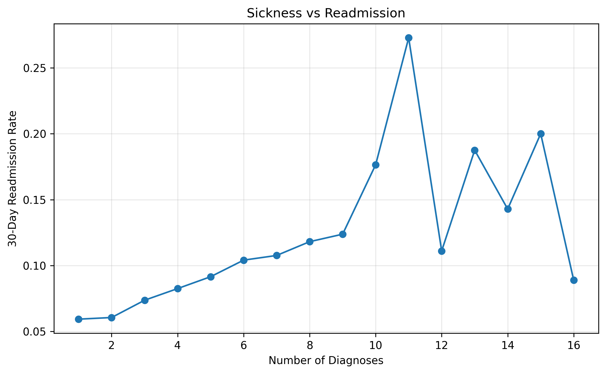

# Healthcare Readmission Risk Analysis

---

### *Project Overview*

This project analyzes **100,000+ patient encounters from 130 U.S. hospitals** to identify key drivers of hospital readmissions.

The goal is to understand patient risk patterns and support hospitals in:
- Reducing avoidable readmissions  
- Improving patient outcomes  
- Optimizing hospital capacity and resources  

---

### *Objective*

- Identify high-risk patient segments  
- Analyze clinical and demographic factors affecting readmission  
- Study impact of comorbidities, medications, and hospital stay duration  
- Provide data-driven recommendations for hospitals  

---

### *Key Insights*

- Overall readmission rate: **~45%**
- Patients aged **60–80 years** show highest readmission risk  
- Patients with **7+ diagnoses** have significantly higher readmission rates (~79%)  
- Longer hospital stay (>3 days) is linked with higher readmission risk  
- Certain medication patterns show variation in readmission likelihood  

---

### *Visualizations*

The project includes key visual insights stored in the `Visuals/` folder:

- 📊 Age vs Readmission → `age_readmit.png`

- 👥 Gender vs Readmission → `gender_readmit.png`

- 🏥 Length of Stay vs Readmission → `LOS_vs_Readmission.png`

- 🧬 Sickness (Comorbidities) vs Readmission → `Sickness_vs_Readmission.png`  

---

### *Feature Engineering*

Created risk-based features to improve analysis:

- `frequent_inpatient` → identifies repeated hospital visits  
- `high_diagnosis` → captures comorbidity burden  
- `long_stay` → flags extended hospital stays  
- `total_visits` → measures healthcare utilization intensity  

---

### *Business Recommendations*

- Focus follow-up programs on patients aged **60–80 years**  
- Prioritize care for patients with **multiple diagnoses (7+)**  
- Improve discharge planning for **patients staying >3 days**  
- Monitor high-risk medication patterns for better outcomes  
- Strengthen post-discharge monitoring for vulnerable patients  

---

### *Tools & Technologies*

- **Python** → Pandas, NumPy  
- **Visualization** → Matplotlib, Seaborn  
- **Jupyter Notebook** → Data cleaning & EDA  
- **CSV** → Data storage & preprocessing  

---

### *Outcome*

Delivered a structured healthcare analytics project that identifies high-risk patient groups and provides actionable insights to reduce readmissions and improve hospital efficiency.
